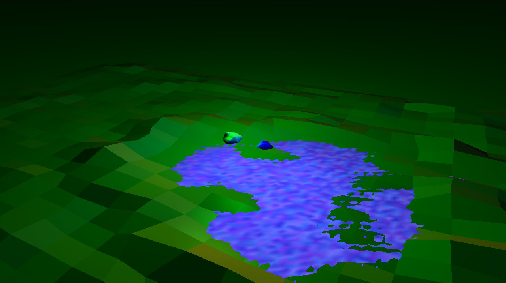
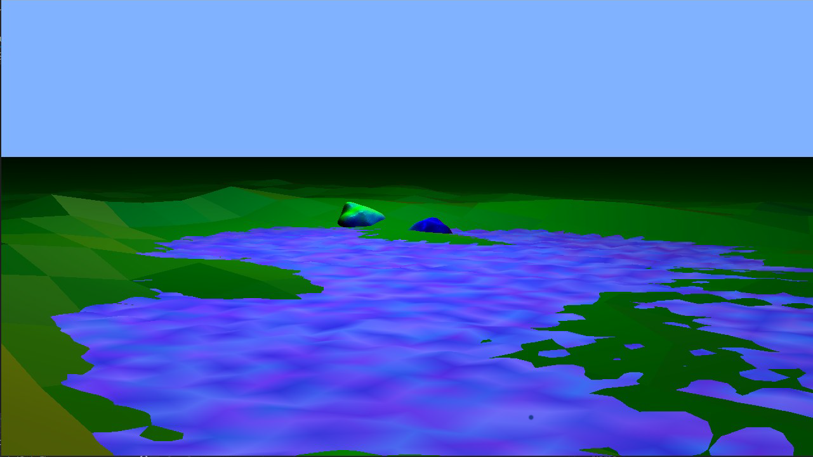

# Water_simulation
Water surface simulation with polygons, wave simulation of the surface using C++ and OpenGL.

Librarys and tools used in application:
- GLM
- GLEW
- OBJ loader
- GLFW

## Description

Models were created in Blender then were loaded as obj files into the scene using OBJ loader. 
Shaders were used to light the scene. Waves are created by changing the height of points in the grid.

The project consists of 2 header files and 1 source file :

IncludeHeaders.h - for better convenience, most of the needed #include notations and the used
namespaces used are written in this header file.

Model.h - the file contains a class whose methods are used to : initialize shaders, upload the
3D model, drawing the model, and a number of universal functions for passing matrices from the
program to the shader.

Main.cpp - the most important file of the application, which contains the main loop of the program. It is responsible for
initialization of shaders and models and their placement on the scene, provides support for controlling
camera movements for the user, for testing purposes it calculates the initialization times of shaders and
models uploaded to the scene.

## Images

